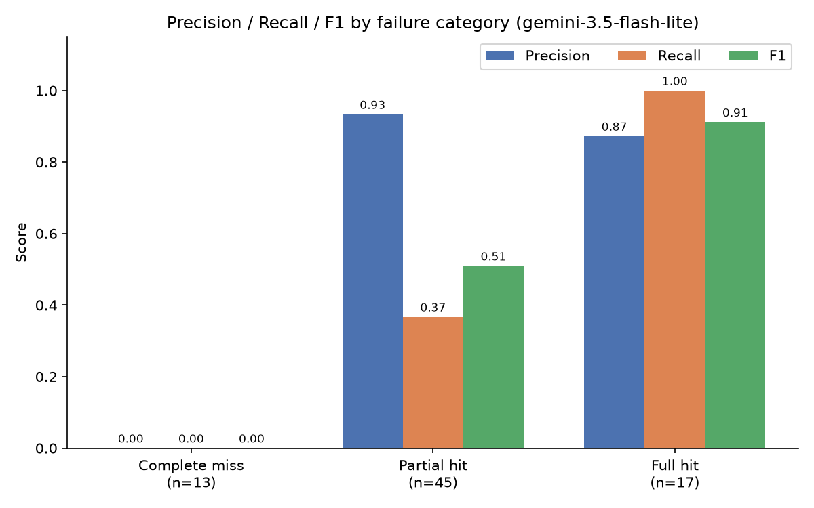

# Issue Localizer

Given a GitHub issue description, predict which files need to change to fix
it — evaluated against real historical data (merged PRs that closed real
issues).

## Results

<!-- TODO: narrative -->

Evaluated against 80 real [python-pillow/Pillow](https://github.com/python-pillow/Pillow)
issues (73 scored; 7 excluded as API infra failures, not prediction failures)
using `gemini-3.5-flash-lite` as the agent's reasoning model:

| Metric | Value |
|---|---|
| Precision (macro-avg) | 0.740 |
| Recall (macro-avg) | 0.553 |
| F1 (macro-avg) | 0.591 |
| Avg. tool-call turns per example | 5.5 (cap: 6) |
| Full-hit rate (every correct file found) | 31.5% (23/73) |



Full category breakdown, failure analysis, and per-example results:
[results/eval_report.md](results/eval_report.md). Regenerate with
`python src/evaluate.py` (see [src/evaluate.py](src/evaluate.py)).

### Iteration

The first pass (v1) had strong precision but weak recall: the agent tended
to find one correct file and stop, under-covering issues that plausibly
touched multiple files (e.g. a plugin file + its test file, or a C-level
implementation file behind a Python plugin). Two changes targeted that:
raising `semantic_search`'s `top_k` from 8 to 20 so the agent sees more
candidate chunks per query, and prompting it to explicitly check for likely
sibling files (a test file, a C source file) before finalizing predictions,
rather than stopping at the first plausible match.

| Metric | v1 | v2 (current) |
|---|---|---|
| Precision | 0.758 | 0.740 |
| Recall | 0.447 | 0.553 |
| F1 | 0.512 | 0.591 |
| Full-hit rate | 22.7% | 31.5% |

Recall and F1 both improved meaningfully for only a marginal precision
cost. Full before/after data: [results/eval_report_v1.md](results/eval_report_v1.md)
vs. [results/eval_report.md](results/eval_report.md).

Eventual scope: a local vector index over a repo's code, an agent that
searches the index and can grep/read files, and an eval harness comparing
predictions against real merged-PR file changes.

## Phase 1 (current)

Just the dataset. `src/mine_dataset.py` mines a clean eval set from a real
repo's GitHub history: closed issues that were closed by exactly one merged
pull request, paired with the list of files that PR changed.

Target repo is [python-pillow/Pillow](https://github.com/python-pillow/Pillow),
configured in [src/config.py](src/config.py) — change `REPO_OWNER`/`REPO_NAME`
there to point at a different repo.

### Setup

```bash
pip install -r requirements.txt
cp .env.example .env
# then edit .env and set GITHUB_TOKEN=<a GitHub personal access token>
```

A token is required — the miner uses the GitHub GraphQL API, which requires
authentication even for public repos. A classic token with the `repo` scope
(or a fine-grained token with public-repo read access) works.

### Run

```bash
python src/mine_dataset.py
```

This writes `data/eval_dataset.jsonl`, one JSON object per line:

```json
{"issue_title": "...", "issue_body": "...", "changed_files": ["src/foo.py", "tests/test_foo.py"]}
```

The script paginates through the repo's closed issues (newest first),
follows each issue's timeline to find a `CLOSED_EVENT` whose closer was a
merged pull request, and only keeps the issue if that PR is the *single*
unambiguous closer. Issues without a clean, single merged-PR link are
skipped — no guessing. It backs off automatically on GitHub API rate limits
and stops once it collects the configured target number of examples (see
`TARGET_EXAMPLES` in `src/config.py`).

### Not yet in scope

The vector index, the search/grep agent, and the eval harness are future
phases and are intentionally not part of this repo yet.
